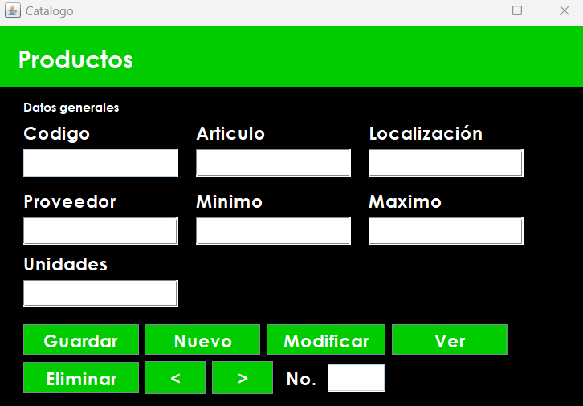
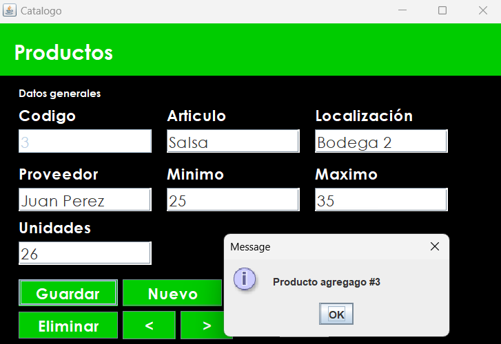
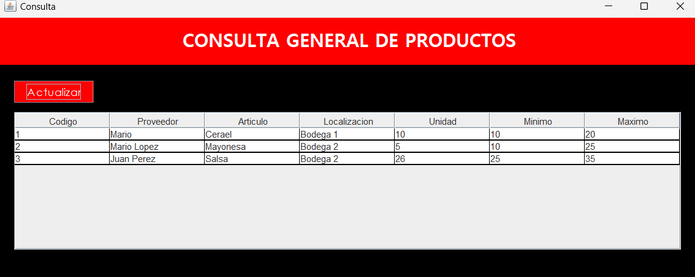
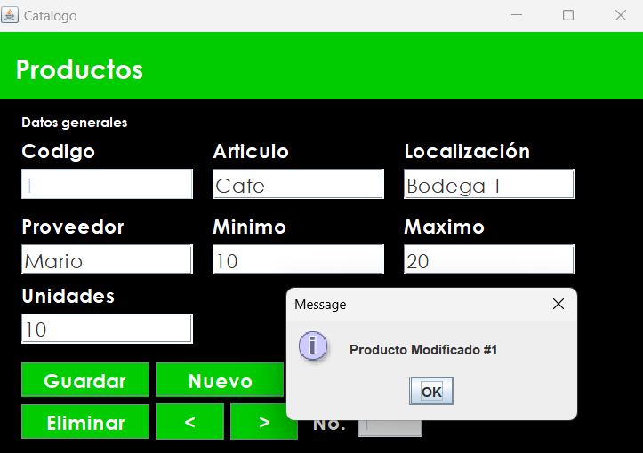
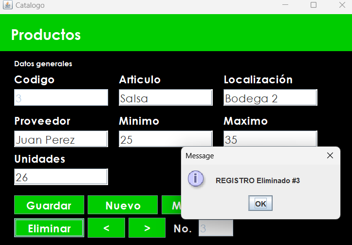

# Proyecto-kardex con Netbeans 👨‍💻
Este proyecto está basado en un sistema de kardex creado en NetBeans y en el lenguaje de programación Java. Permite el registro de productos, la visualización de los mismos y un control de inventario mediante un kardex que permite el ingreso de movimientos, tanto entradas como salidas.

## Funcionalidades
- Registro de productos.
- Visualización de productos registrados.
- Control de inventario mediante un kardex.
- Ingreso de movimientos (entradas y salidas) de los productos.

## Requisitos
- Tener instalado Java Development Kit (JDK) en su computadora.
- Tener instalado el entorno de desarrollo de aplicaciones NetBeans.

## Instalacion
- Clone este repositorio en su computadora:
- Abra el proyecto en NetBeans.
- Compile y ejecute el proyecto.

## Uso
El proyecto cuenta con una interfaz gráfica de usuario que le permitirá registrar productos, visualizarlos y realizar los movimientos (entradas y salidas) correspondientes.

### Menu
Una vez ejecutando nuestro proyecto, podemos visualizar nuestra interfaz respectivamente la cual nos permite agregar y consultar respectivamente 


### Agregar productos
Una vez seleccionada la opcion agregar. almacenamos nuestros productos respectivamente todo esto llevado acabo mediante un codigo unico, el nombre de nuestro articulo, su localizacion etc.




### Visualizar registros
Una vez alamacenado todos nuestros registros respectivamnete podemos visuzalizarlos, todo esto mediante nuestra tabla


### Actualizar producto
Mediante los botones < >, podemos movernos en los registros y poder seleccionar cual es el registro que deseamos modficar, una vez modificado los datos le damos click al boton modificar y nos saldra un mensaje respectivamente 


### Eliminar
Nuestro boton eliminar respectivamente nos permite borrar el registro respectivo, todo esto se realiza seleccionando desde el boton <> el cual permite visualizar de mejor manera el articulo que se desea eliminar 


## Contribución
Si desea contribuir a este proyecto, siga las siguientes instrucciones:

1. Fork este repositorio.
2. Cree una rama para su contribución (ej. feature/nueva-funcionalidad).
3. Haga sus cambios en la rama creada.
4. Cree un pull request hacia el repositorio original.

## Distribucion archivos importantes
```
Proyecto kardex
├─ .git
├─ .gitignore
├─ build
├─ dist
│  ├─ Project-kardex.jar
│  └─ README.TXT
├─ nbProject
├─ src
│  ├─ Main.java
│  ├─ Registro.java
│  ├─ Producto.java
│  ├─ SG.java
│  ├─ Abonos.java
│  ├─ Registros.java
│  ├─ Productos.java
│  ├─ Menu.java
│  ├─ AgregarProducto.java
│  ├─ AgregarRegistro.java
│  ├─ ConsultaProductos.java
│  ├─ Menu.form
│  ├─ AgregarProducto.form
│  ├─ AgregarRegistro.form
│  ├─ ConsultaProductos.form
│  ├─ Tienda-icono.png
├─ build.xml
├─ manifest.mf
└─ README.md
```


## Licencia
Este proyecto está bajo la licencia MIT.
